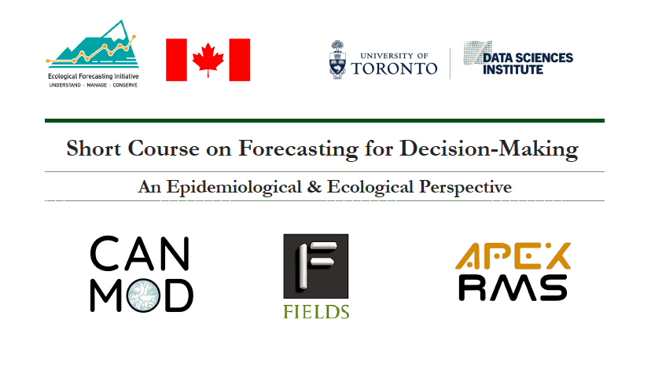

## Overview

Welcome! This repository contains all materials from the Canadian Ecological Forecasting Initiative short course on Forecasting for Decision-Making: An Epidemiological & Ecological Perspective. The course took place at the Fields Institute in Toronto, ON from July 24th - 28th 2023.

In the spirit of having this course be as open as possible, we have put all the course materials here on this GitHub page, including lectures, exercises and forecast modelling materials for three case studies: Infectious Disease Control, Fisheries Management, Water Quality Monitoring. For a description of the course's overall objectives, please see [here](http://www.fields.utoronto.ca/activities/23-24/forecasting).

However, please note that the content here does not all belong exclusively to CEFI. CEFI-specific content presented here is governed by a CC-BY 4.0 licence, but all other content herein is owned by it's original creator and CEFI does not hold rights or permissions. 

For any questions about the course or about this repository please email [k.bodner@mail.utoronto.ca](k.bodner@mail.utoronto.ca). 

[![CC BY 4.0][cc-by-shield]][cc-by]

This work is licensed under a
[Creative Commons Attribution 4.0 International License][cc-by].

[![CC BY 4.0][cc-by-image]][cc-by]

[cc-by]: http://creativecommons.org/licenses/by/4.0/
[cc-by-image]: https://i.creativecommons.org/l/by/4.0/88x31.png
[cc-by-shield]: https://img.shields.io/badge/License-CC%20BY%204.0-lightgrey.svg

## How to Use This Repository

All code and documentation herein is free to use! If you were unable to make it to the course in person, or simply want to go through this material on your own time, please feel free. This repository is structured into 3 main sections.

### Lectures

First, is the `Lectures` folder, where the various lecture materials can be found for the course. These lectures were recorded, and the recording videos can be found on the [CEFI website](https://youtube.com/playlist?list=PLmpgJtGjCb06k0MMg6WFPbVIQq01O0K5X&si=VhCaBp1H4-AksiMK).

Here is the course schedule. We suggest you roughly follow along with the order of lectures here. 

#### Schedule

|      Time Slots       |     |                                      |                                                                             Monday                                                                              |                                                                   Tuesday                                                                   |                                                                               Wednesday                                                                                |                                                           Thursday                                                           |                                                                 Friday                                                                  |
|:-------:|---------|:-------:|:-------:|:-------:|:-------:|:-------:|:-------:|
| 9:00  -  10:00  |     |              Lecture 1               | Topic(s):  (1) Introductions & Schedule Overview;   (2) Introduction to Forecasting  Lead(s):  (1) KB, CRF & Instructors;  (2) Mike Dietze |                                    Topic:  Bayesian Analysis - Part 2  Instructor: Mike Dietze                                     |                                                       Topic:  Model Assessment  Instructor: Mike Irvine                                                       |        Topic: Delivering Forecasting Models to Decision Makers  Instructor: Colin Daniel and Alex Filazzola         |                                       Topic:  OCAP Training Part 1   Instructor: OCAP                                       |
| 10:00  -  10:20 |     |             Coffee Break             |                                                                                                                                                                 |                                                                                                                                             |                                                                                                                                                                        |                                                                                                                              |                                                                                                                                         |
| 10:20  -  11:20 |     |              Lecture 2               |                                        Topic:  Introduction to the Modelling Landscape  Instructor: Irena Papst                                        |                                  Topic:  Reproducibility & Transparency  Instructor: Mike Irvine                                   | Topic:  Combining Fish Population Forecasting with Fisheries Management: an Introduction to Management Strategy Evaluation (MSE)  Instructor: Brooke Davis | Topic: Experiences Building Collaborations and Bridging Communication  Instructor: Brooke Davis + Other Instructors | (1) Group Work: Finalize Presentation    (2) Overview of NEON Ecological Forecasting Challenge    Lead: (2) Quinn Thomas |
| 11:20  -  11:30 |     |                Break                 |                                                                                                                                                                 |                                                                                                                                             |                                                                                                                                                                        |                                                                                                                              |                                                                                                                                         |
| 11:30  -  12:30 |     | Extra Practice  or  Lecture 3: |                                              Topic:  Bayesian Analysis - Part 1  Instructor: Mike Dietze                                               |                                           Exercise 2: Paired Coding   Lead: Mike Dietze                                            |                                [Exercise 3: MSE Exercise](https://mdmazur.shinyapps.io/ToyGroundfishMSE/)   Lead: Brooke Davis                                |                           Topic:  Decision Analysis in Health   Instructor: Beate Sander                            |                                     Group Work:  Finalize Presentation    Closing Remarks                                      |
|  12:30 -  1:30  |     |                Lunch                 |                                                                                                                                                                 |                                                                                                                                             |                                                                                                                                                                        |                                                                                                                              |                                                                                                                                         |
|  1:30  -  3:00  |     | Extra Practice  or  Lecture 3: |                                   Exercise 1:  Introduction to Bayesian Analysis  Lead(s): Mike Dietze + Mike Irvine                                   | Topic(s): (1) Code Review Example; (2) Propagating, Analyzing, & Reducing Uncertainty  Instructor: Mike Dietze + Irena Papst |                                                                               Group work                                                                               |             Exercise 4:  Writing Lay Summaries Exercise  Lead: Korryn Bodner and Carina Rauen Firkowski             |                                                 Group Project Presentations  Part 1                                                  |
|  3:00 -  3:20   |     |             Coffee Break             |                                                                                                                                                                 |                                                                                                                                             |                                                                                                                                                                        |                                                                                                                              |                                                                                                                                         |
|   3:20 - 5:30   |     |              Group Work              |                        Case Study Introductions (30 mins)  Case Study Overviews (in small groups)  Lead(s): All Instructors                         |                                                                 Group work                                                                  |                                                                               Group work                                                                               |                                                          Group work                                                          |                                      Group Project Presentations  Part 2    End at 3:50pm                                      |
|                       |     |                                      |                                                                                                                                                                 |                                                                                                                                             |                                                                                                                                                                        |                                                                                                                              |                                                                                                                                         |
|  6:00 -  8:00   |     |                                      |                                                                                                                                                                 |                                                                                                                                             |                                                                                                                                                                        |                                                         Group Dinner                                                         |                                                                                                                                         |

### Exercises

There are a series of exercises in the `Exercises` folder for you to work through. Instructions are in the `README_EXERCISES.md` file in that directory for how to make use of those. 

There are a number of exercises that span a couple of programming approaches to the current course content. 

### Case Studies

Perhaps most importantly, we have our four case studies. A focal point of this course is having students take a case study of interest, and work on building and expanding a forecast for a focal system. In this iteration of the course there are four case studies, one on fisheries, one on water quality, and two on COVID-19. Each of the COVID-19 case studies are from different locations (Ontario and BC respectively) and take slightly different approaches. 

There are extensive documentation for each of the case studies in their respective folders, along with troubleshooting tips. Please take the time to read through each case study before starting, as each of them have slightly different software requirements. During the in-person version of this course, each case study had two teams of four students working on each one. They have tackled some of the "Decision making problems" that the instructors suggested as ways the models could be extended. You're welcome to look through their code and results as examples of how each group chose to tackle the problem. 
